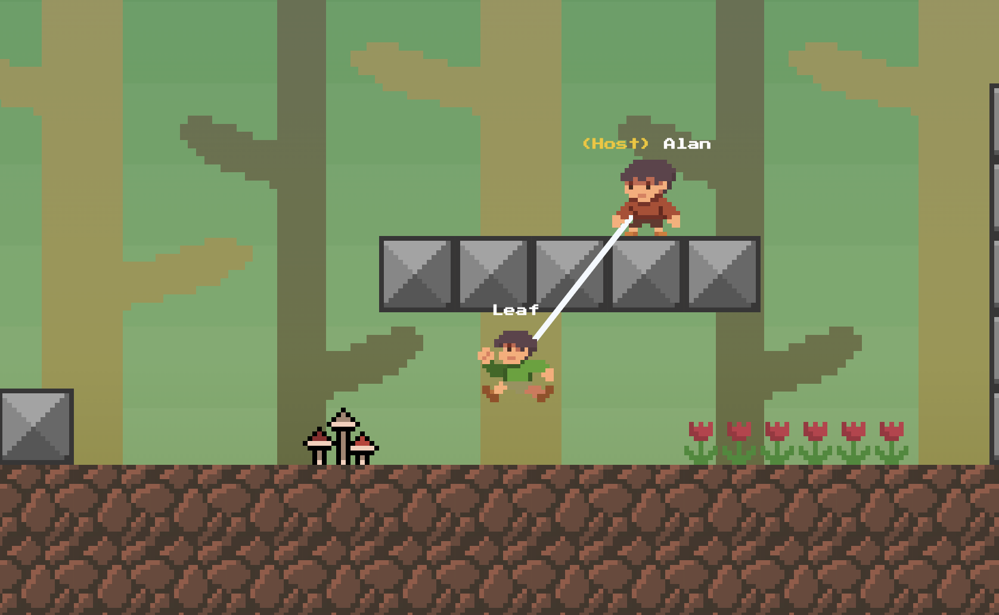
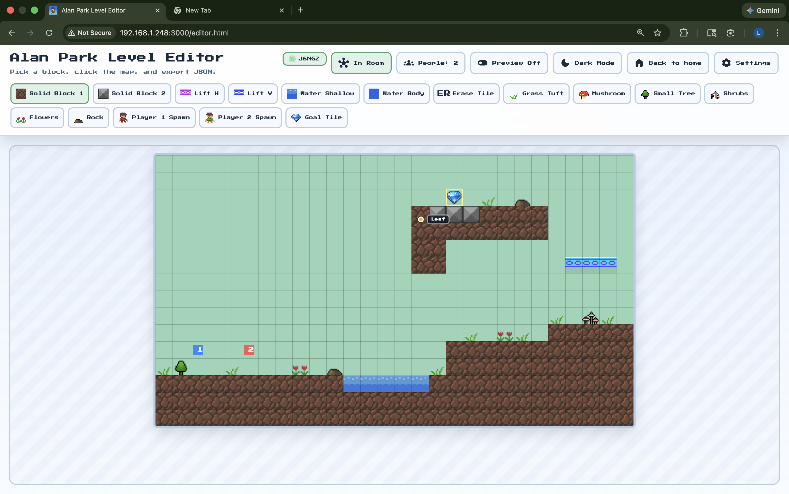
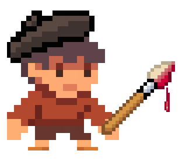

## What is it?
A 2D-platformer game inspired by Super Mario Bros. with the gimmick of two players being tethered together. Players must collaborate together to reach the goal.

### Core Gameplay
- 2-player room with **host/join** flow using a 5-character room code.
- Both players are connected by a **configurable tether** (host can adjust from menu and in the HUD), and must both work together to clear the level.
- Round completes only when **both players are inside the goal**.



### Controls
| Action | Keyboard |
| --- | --- |
| Movement | WASD / Arrow Keys |
| Jump | Space / W |
| Menu/Pause/Restart | On-screen buttons |


### Editor
Built-in browser editor for creating/editing/testing level JSON files for use in-game, similar to Mario Maker.

#### Editor Features
- Import level from file or pasted text.
- Export level JSON for use in the game.
- Live preview mode to run/test levels directly in editor.
- Light/dark theme toggle.
- **Real-time** collaboration:
  - Create/join editor rooms for people on the same network to work on levels.
  - Participant list + live cursors.



#### Workflow
Once you've made your level in the editor, you can export the JSON and then put it in the `public/levels/` folder to be able to use it in game. There are currently 3 levels built in!

### Demo Video
<video src="demo-assets/demo-video.mp4" controls width="90%"></video>

## How to install/run locally
Ensure you have Node.js **18+** installed (npm is included with Node.js).

After doing that:
1. Download/clone the repository to your device.

2. Open Terminal and change directory to the project folder.

3. On Terminal, run these commands:
```
npm install
```
and then
```
npm start
```
4. Open the Development Server URL shown in Terminal.
   - For local play on the same machine, use `http://localhost:3000`.
   - For players joining from other devices on your network, use your LAN IP URL (example: `http://192.168.1.248:3000`).

5. Enjoy. 🎉

## Credits
**Image Assets:** All images/in-game assets were drawn by me, Lukas, using digital editing software.



**Codex:** OpenAI's Codex tool was used for most of the orchestration of the code.
