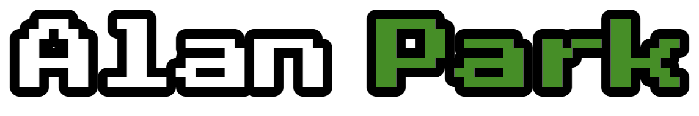
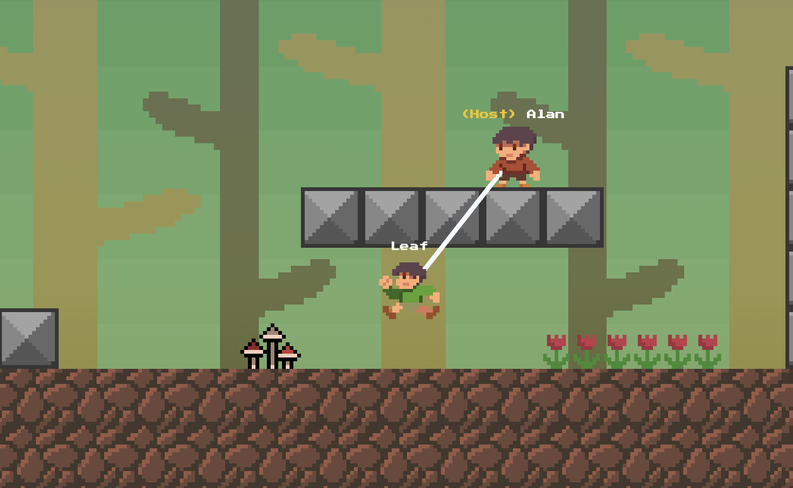
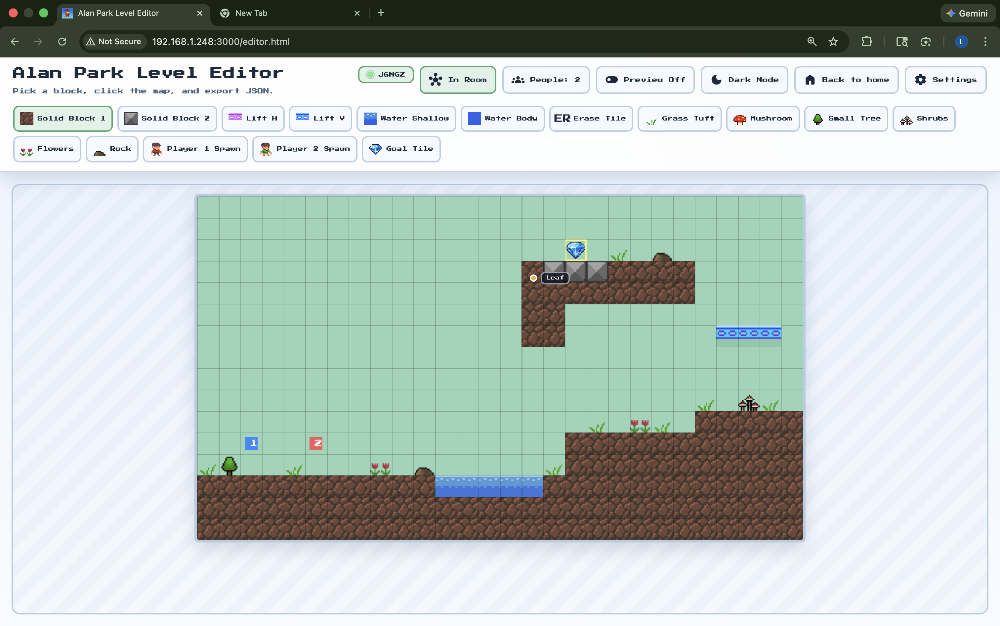
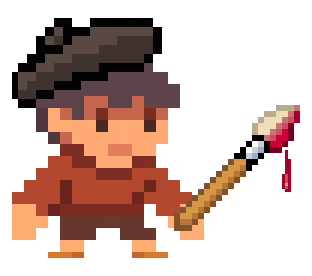

## What is it?
A 2D-platformer game inspired by Super Mario Bros. with the gimmick of two players being tethered together. Players must collaborate together to reach the goal.

### Core Gameplay
- Choose a trail, create a room, and invite a partner with a **5-character code or invite link**.
- The lobby shows both players. The host selects **Start Together** once both have joined.
- Both players are connected by a **configurable tether** (host can adjust from menu and in the HUD), and must both work together to clear the level.
- Round completes only when **both players are inside the goal**.



### Controls
| Action | Keyboard |
| --- | --- |
| Movement | WASD / Arrow Keys |
| Jump | Space / W |
| Menu/Pause/Restart | On-screen buttons |


### Editor
Built-in browser editor for creating/editing/testing level JSON files for use in-game, similar to Mario Maker.

#### Editor Features
- Import level from file or pasted text.
- Export level JSON for use in the game.
- Live preview mode to run/test levels directly in editor.
- Light/dark theme toggle.
- **Real-time** collaboration:
  - Create/join editor rooms for people on the same network to work on levels.
  - Participant list + live cursors.



#### Workflow
Once you've made your level in the editor, you can export the JSON and then put it in the `public/levels/` folder to be able to use it in game. There are currently 3 levels built in!

### Demo Video
<video src="demo-assets/demo-video.mp4" controls width="90%"></video>

## How to install/run locally
Ensure you have Node.js **18+** installed (npm is included with Node.js).

After doing that:
1. Download/clone the repository to your device.

2. Open Terminal and change directory to the project folder.

3. On Terminal, run these commands:
```
npm install
```
and then
```
npm start
```
4. Open the Development Server URL shown in Terminal.
   - For local play on the same machine, use `http://localhost:3000`.
   - For players joining from other devices on your network, use your LAN IP URL (example: `http://192.168.1.248:3000`).

5. Enjoy. 🎉

## Vercel deployment

The live game is at [alan-park.vercel.app](https://alan-park.vercel.app).
Deploy this repository as an Express app with Fluid compute enabled. `server.js`
exports the HTTP server so Vercel can handle WebSocket upgrades; `npm start`
still runs the same server locally.

Both the game and editor use the WebSocket transport directly. Do not change
them to Socket.IO's default HTTP polling: polling requests can reach different
Vercel instances and fail with `Session ID unknown`. See
[Vercel's WebSocket documentation](https://vercel.com/docs/functions/websockets).

Two players are required to start a round. Open the game on two devices or in
two browser tabs, choose a trail and create a room, then join with its
five-character code or invite link. The host starts both players together.

Brief connection interruptions reserve the player's slot for 30 seconds and
pause the match while reconnecting. Recovery restores the existing room when
the same server instance is available. Rooms are temporary, in-memory sessions:
Vercel restarts, function time limits, new deployments, or connections routed to
different instances can end a room. Durable rooms and guaranteed coordination
across instances require an external shared store and simulation ownership;
a Socket.IO broadcast adapter alone is not sufficient.

## Verification

```sh
npm ci
npm run check
npm test
```

The tests start a server on a free port and check all three levels, two-player
movement and jumping, host-only settings, restart voting, spectators, room
cleanup, reconnect recovery, and editor collaboration. To check a deployed
server instead:

```sh
TEST_URL=https://alan-park.vercel.app npm test
```

The deployed checks create temporary test rooms and disconnect when finished.
Puppeteer is a development-only dependency for the older manual browser scripts;
the automated `npm test` suite does not need a browser download.

## Credits
**Image Assets:** All images/in-game assets were drawn by me, Lukas, using digital editing software.



**Codex:** OpenAI's Codex tool was used for most of the orchestration of the code.
